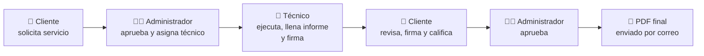

# 🛡️ Servisel · Plataforma de Informes Técnicos

**Aplicación web full stack en producción** que digitaliza el flujo de servicios técnicos de una empresa de seguridad electrónica (CCTV, alarmas, control de acceso) en Medellín, Colombia.

> 🔒 El código fuente es privado por acuerdo con el cliente. Este repositorio presenta el proyecto: arquitectura, funcionalidades y capturas con **datos ficticios**. Demo en vivo disponible bajo solicitud.

<p align="center">
  
  
  
</p>

---

## 🔄 Flujo del servicio



## ✨ Funcionalidades

- **3 roles** con permisos diferenciados: administrador, técnico y cliente.
- **Autenticación JWT + bcrypt**, con cambio obligatorio de contraseña temporal en el primer ingreso.
- **Formulario técnico móvil:** fecha, ubicación, horarios, selección múltiple de sistemas, tipo de servicio, descripción, materiales y estado.
- **Hasta 5 fotos por informe** desde la galería del celular, comprimidas en el servidor.
- **Firma digital** del técnico y del cliente dibujada en pantalla.
- **PDF del informe** generado a demanda y enviado por correo al cliente.
- **PQRS y calificaciones** del servicio, visibles solo para el administrador.
- **Notificaciones internas** para técnicos y administradores.
- **Programación de mantenimientos** con exportación a Excel.

## 🏗️ Arquitectura

```mermaid
flowchart LR
    U[📱 Navegador / celular] -->|HTTPS| N[Nginx<br>proxy inverso]
    N -->|/| FE[Frontend<br>React + Vite]
    N -->|/api| BE[Backend<br>FastAPI + Uvicorn]
    BE --> DB[(PostgreSQL 15)]
    BE --> SMTP[✉️ Correo SMTP]
    BE --> FS[📁 Fotos y PDFs]
    FS -. respaldo SFTP cifrado .-> NAS[(NAS de la empresa)]
    subgraph VPS Ubuntu · Docker Compose
      FE
      BE
      DB
    end
```

## 🛠️ Tecnologías

| Área | Herramientas |
|---|---|
| Backend | Python, FastAPI, SQLAlchemy, Pydantic, JWT, bcrypt |
| Frontend | React, Vite, React Router, signature_pad |
| Base de datos | PostgreSQL (7 tablas relacionales) |
| Documentos | WeasyPrint (PDF), openpyxl (Excel), Pillow (imágenes), fastapi-mail (SMTP) |
| Infraestructura | Docker Compose, Nginx, Ubuntu Server (VPS), UFW |
| Control de versiones | Git / GitHub |

## 🗄️ Modelo de datos

`usuarios` · `solicitudes` · `informes` · `fotos_informe` · `pqrs` · `calificaciones` · `notificaciones`

<p align="center"></p>

## 🚀 Despliegue

- Tres servicios en **Docker Compose**: base de datos, backend y frontend.
- **Nginx** en el servidor como proxy inverso: `/` va al frontend y `/api` al backend.
- Servidor protegido con firewall, usuario sin privilegios de root y variables de entorno para los secretos.
- Actualización con `git pull` + `docker compose up -d --build`.
- Respaldo de informes hacia el NAS de la empresa por **SFTP cifrado**: el NAS inicia la conexión y nunca queda expuesto a internet.

## 🧠 Qué aprendí

- Levantar requerimientos con un cliente real y convertirlos en un modelo de datos y un flujo por roles.
- Diseñar una API REST segura con autenticación y autorización por roles.
- Construir interfaces pensadas para el trabajo en campo desde el celular.
- Contenerizar, desplegar y mantener una aplicación en producción en un VPS Linux.

---

Desarrollado por **Silvia Melo** · Freelance · Jun.–Sep. 2026 · [github.com/Scmelor](https://github.com/Scmelor)
